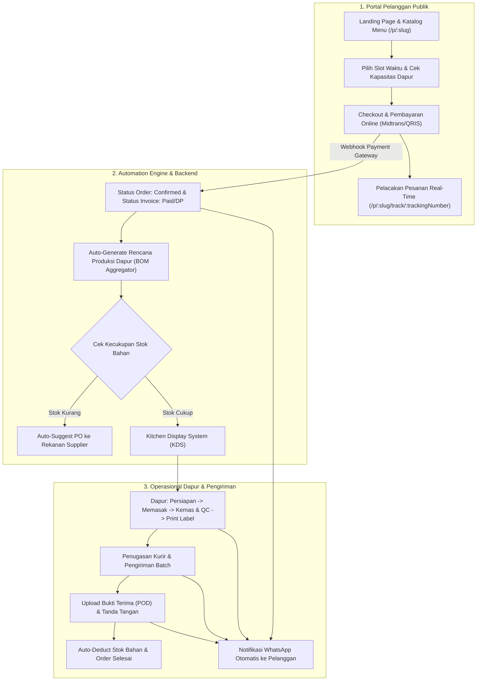

# Rencana Implementasi: Fase 2 - Digitalisasi Penuh & Otomatisasi

Dokumen ini merinci arsitektur, skema database, alur sistem, dan rencana implementasi teknis untuk **Fase 2: Digitalisasi Penuh & Otomatisasi** pada CaterOS (Laravel + React Multi-Tenant Catering Management System).

---

## 1. Arsitektur & Alur Kerja Ujung-ke-Ujung (End-to-End Workflow)

---

## 2. Rincian Modul & Kebutuhan Teknis

### 2.1 Portal Pelanggan (Customer-Facing Web)
* **Tujuan**: Pelanggan dapat melihat katalog, memesan mandiri, dan melacak pesanan tanpa perlu instalasi aplikasi.
* **Backend:**
  - `GET /api/v1/public/tenant/{slug}/profile-and-menu`: Mengambil info branding, kategori, menu satuan, paket bundling, serta area jangkauan kirim.
  - `POST /api/v1/public/tenant/{slug}/check-capacity`: Validasi kuota porsi harian katering pada tanggal acara.
  - `POST /api/v1/public/tenant/{slug}/checkout`: Pembuatan pesanan mandiri pelanggan publik, menerbitkan nomor tracking (`TRK-XXXXXXXX`) dan draft faktur.
  - `GET /api/v1/public/orders/track/{trackingNumber}`: Pelacakan status pesanan publik (Confirmed $\rightarrow$ In Production $\rightarrow$ Delivering $\rightarrow$ Delivered).
  - `POST /api/v1/public/auth/customer-login`: Login cepat pelanggan via nomor telepon / email untuk melihat riwayat order.
* **Frontend (Customer Portal):**
  - Route `/p/:slug`: Landing page tenant dengan tema modern, filter kategori, dan pencarian menu.
  - Wizard Pemesanan Interaktif:
    1. Pilih Tanggal & Jam Pengantaran
    2. Pilih Menu & Porsi Makanan
    3. Input Alamat Pengiriman & Kontak Penerima
    4. Review Order & Metode Pembayaran
  - Halaman Pelacakan Pesanan Real-time (`/p/:slug/track/:trackingNumber`).
  - Halaman Riwayat Transaksi Pelanggan.

---

### 2.2 Integrasi Payment Gateway (Online Payment)
* **Tujuan**: Menerima pembayaran instan (QRIS, Virtual Account, Credit Card) dan mengotomatiskan update status pesanan.
* **Backend:**
  - `PaymentGatewayService`: Layanan integrasi Midtrans Snap & Xendit (mendukung mode Sandbox & Mock Simulator).
  - `POST /api/v1/public/webhooks/payment-gateway`: Endpoint webhook penerima notifikasi pembayaran dengan verifikasi signature hash SHA512.
  - Auto-transition: Update status pembayaran invoice (`partially_paid` / `paid`) dan status order menjadi `confirmed`.
* **Frontend:**
  - Embed pembayaran online pada modal checkout & modal faktur invoice.
  - Halaman Payment Success dengan konfirmasi instan.

---

### 2.3 Modul Produksi Dapur Otomatis (Kitchen Display System)
* **Tujuan**: Memandu staf dapur mengolah menu sesuai porsi pesanan harian dan mengurangi stok bahan secara otomatis.
* **Database Migration:**
  - `production_plans` (`id`, `tenant_id`, `plan_date`, `total_portions`, `status`, `notes`)
  - `production_tasks` (`id`, `production_plan_id`, `order_id`, `menu_item_id`, `quantity`, `stage`, `started_at`, `completed_at`)
* **Backend:**
  - `KitchenProductionService`:
    - Mengagregasikan seluruh pesanan pada tanggal H menjadi 1 rencana produksi harian terpadu.
    - Menghitung total kebutuhan bahan baku berdasarkan formula resep BOM ($\sum \text{BOM} \times \text{Porsi}$).
    - Mengurangi stok bahan baku di gudang (*Auto-deduct*) saat batch produksi ditandai `ready` / `completed`.
  - Endpoint KDS:
    - `GET /api/v1/tenant/kitchen/today`
    - `PATCH /api/v1/tenant/kitchen/tasks/{id}/status`
    - `POST /api/v1/tenant/kitchen/complete-production`
* **Frontend (Kitchen View - `/kitchen`):**
  - Tampilan Kitchen Display System (KDS) ramah tablet dengan kolom alur:
    **Persiapan (Prep) $\rightarrow$ Memasak (Cooking) $\rightarrow$ Kemas & QC (Packing)**.
  - Cetak Label Kemasan Kotak / Nota Produksi Dapur dalam 1 klik.

---

### 2.4 Modul Pengadaan (Smart Procurement) Otomatis
* **Tujuan**: Mencegah kekurangan stok bahan dapur saat ada pesanan besar.
* **Backend:**
  - Endpoint `GET /api/v1/tenant/procurement/auto-suggest`:
    - Menghitung kekurangan bahan baku: $\text{Kebutuhan Produksi Harian} + \text{Minimum Stok} - \text{Stok Saat Ini}$.
  - Endpoint `POST /api/v1/tenant/procurement/auto-generate-po`: Membuat draft PO ke supplier rekanan dengan harga beli terbaru dalam 1 klik.
* **Frontend:**
  - Tombol **"Rekomendasi Pembelian Otomatis"** di halaman Purchase Orders.
  - Wizard auto-generate PO berdasarkan kebutuhan porsi dapur.

---

### 2.5 Modul Pengiriman & Kurir (Delivery Management & POD)
* **Tujuan**: Mengatur pengiriman pesanan per zona wilayah dan mencatat bukti serah terima di lokasi.
* **Database Migration:**
  - `deliveries` (`id`, `tenant_id`, `order_id`, `courier_name`, `courier_phone`, `vehicle_number`, `status`, `dispatched_at`, `delivered_at`)
  - `delivery_proofs` (`id`, `delivery_id`, `recipient_name`, `photo_url`, `signature_data`, `notes`, `delivered_at`)
* **Backend:**
  - API penugasan kurir, status pengiriman (`dispatched`, `delivered`), dan upload foto bukti serah terima (POD).
* **Frontend (Halaman `/deliveries`):**
  - Manajemen penugasan batch pengiriman per zona area.
  - Modal upload foto bukti terima, tanda tangan digital penerima, dan konfirmasi nama penerima di lokasi acara.

---

### 2.6 Integrasi Notifikasi WhatsApp Resmi
* **Tujuan**: Mengirimkan pembaruan otomatis ke WhatsApp pelanggan secara real-time.
* **Backend:**
  - `WhatsAppNotificationService`: Layanan pengiriman notifikasi terintegrasi untuk:
    1. Konfirmasi Pemesanan & Rincian Pesanan.
    2. Tagihan Faktur Uang Muka (DP) & Pelunasan.
    3. Notifikasi Pesanan Sedang Dikirimkan Kurir.
    4. Notifikasi Pesanan Telah Diterima (disertai foto bukti terima).
  - Background Queue Job untuk memastikan proses pengiriman pesan tidak menghambat performa API.
* **Frontend:**
  - Pengaturan template dan nomor WhatsApp pengirim di menu Settings.

---

## 3. Rencana Eksekusi Bertahap

| Tahap | Modul | Komponen Backend | Komponen Frontend |
|---|---|---|---|
| **Tahap 1** | **Database Migrations** | Tabel `production_plans`, `production_tasks`, `deliveries`, `delivery_proofs`, kolom `tracking_code` | Update tipe TypeScript |
| **Tahap 2** | **Portal Pelanggan (2.1)** | Public API (`/public/tenant/{slug}/...`, checkout, tracking) | Landing Page `/p/:slug`, Booking Wizard & Tracking View |
| **Tahap 3** | **Payment Gateway (2.2)** | `PaymentGatewayService`, Webhook Handler, Signature Verification | Midtrans Snap dialog & Success Page |
| **Tahap 4** | **Produksi Dapur (2.3)** | `KitchenProductionService`, BOM Auto-deduct, Task Status API | Kitchen Display System (`/kitchen`), Print Label |
| **Tahap 5** | **Pengadaan & Kurir (2.4 & 2.5)**| Auto-suggest PO logic, Delivery Assignment & POD photo upload | Smart PO Wizard & Delivery Management (`/deliveries`) |
| **Tahap 6** | **WhatsApp & Verifikasi (2.6)** | `WhatsAppNotificationService`, Asynchronous Queue Dispatch | Settings WhatsApp & Pengujian Menyeluruh |

---

## 4. Rencana Verifikasi & Testing
* **Automated Tests**:
  - Test Public Catalog, Capacity Check & Online Checkout.
  - Test Payment Gateway Webhook & auto-status synchronization.
  - Test Kitchen Production Plan generation & BOM stock deduction.
  - Test Delivery POD upload & assignment.
* **Build Verification**:
  - `php artisan test` (100% Passed)
  - `npm run build` (0 Errors)
